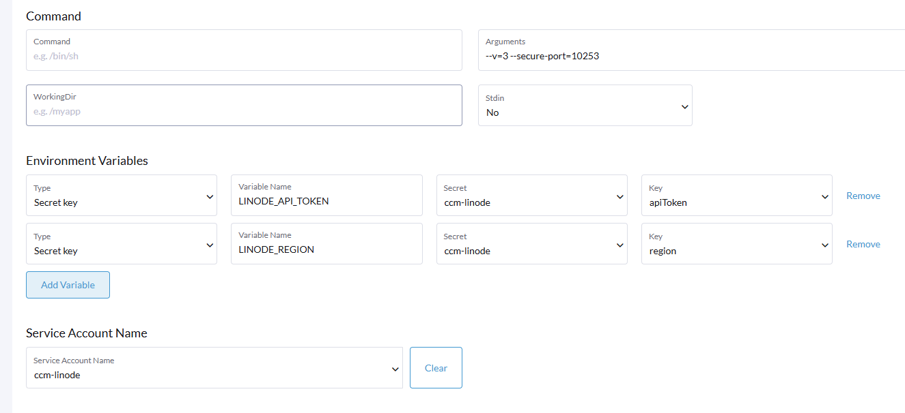

#### 安装Linode CCM，完成后可以通过创建K8S LoadBalance自动创建Linode NodeBalancer
#### 继续安装Linode CSI插件，完成后可以自动创建Volume并挂载

#### 部署CCM步骤
##### Core - Secrets
ccm-linode
apiToken：personal token
region：集群所在region代码，不是名称

##### RBAC
ServiceAccount         ccm-linode  
ClusterRole            ccm-linode-clusterrole  
ClusterRoleBinding        ccm-linode-clusterrolebinding，设置ccm-linode-clusterrole关联 serviceaccount：ccm-linode  

ClusterRole注意事项
添加Resource：leases所有Verbs（cloud-manager-linode中参数必须指定用leases）  
Linode给出的yaml文件中缺了这部分，要手工加  

##### Wordload部署
1. 指定镜像：linode/linode-cloud-controller-manager:v0.4.19  
2. 手工添加： automountServiceAccountToken: true 或者在ServiceAccount直接添加 
3. 移除或修改：hostNetwork:true (如果指定hostNetwork，会报10260端口冲突。实测用默认容器网络即可。)  
4. Linode给出的yaml文件中部分参数已经无效  
    --port=0 （该参数已废弃）  
    --leader-elect-resource-lock=endpoints （此处必须是leases）  

其他启动参数如下：

